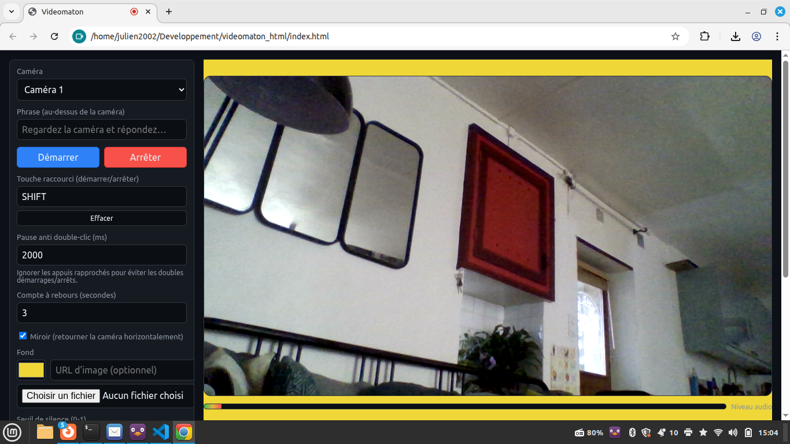

# 🎥 Videomaton

<div align="center">



**Application web de videomaton avec détection automatique de silence**

[🚀 Démo en ligne](https://julienrat.github.io/videomaton_html/) | [📖 Documentation](#fonctionnalités)

</div>

---

## 📋 Description

**Videomaton** est une application web moderne permettant d'enregistrer des vidéos avec détection automatique de silence. Parfaite pour des témoignages, interviews, ou tout enregistrement nécessitant un démarrage/arrêt automatisé.

L'application utilise les API Web modernes (MediaRecorder, Web Audio API, File System Access) pour offrir une expérience fluide et professionnelle directement dans le navigateur.

## ✨ Fonctionnalités

### 🎬 Enregistrement vidéo
- **Aperçu en temps réel** de la caméra
- **Sélection de caméra** (si plusieurs disponibles)
- **Compte à rebours** configurable avant enregistrement
- **Indicateur REC** animé avec bordure rouge pulsante
- **Enregistrement WebM** (VP8/VP9 + Opus)
- **Miroir** : option pour retourner horizontalement l'image

### 🔊 Détection de silence intelligente
- **Arrêt automatique** lorsque le silence est détecté
- **Vu-mètre en temps réel** avec visualisation du niveau audio
- **Calibration automatique** du seuil de silence
- **Seuil et durée configurables** pour s'adapter à tous les environnements
- **Optimisé CPU** : fréquence de mise à jour ajustable pour réduire la charge processeur

### ⌨️ Contrôles et raccourcis
- **Touche personnalisable** pour démarrer/arrêter l'enregistrement
- **Touche `m`** pour afficher/masquer le panneau de paramètres
- **Protection anti double-clic** configurable
- **Détection intelligente** : les raccourcis ne fonctionnent pas dans les champs de saisie

### 🎨 Personnalisation
- **Phrase personnalisée** affichée au-dessus de la caméra
- **Fond personnalisable** : couleur unie ou image
- **Interface adaptative** : mode plein écran ou avec panneau latéral
- **Thème sombre** moderne et élégant

### 💾 Sauvegarde
- **Sauvegarde directe** dans un dossier choisi (Chrome/Edge)
- **Téléchargement automatique** en fallback
- **Nom horodaté** : `videomaton_YYYY-MM-DD_HH-MM-SS.webm`
- **Paramètres persistants** via localStorage

## 🚀 Utilisation

### Démo en ligne
Accédez directement à l'application : **[https://julienrat.github.io/videomaton_html/](https://julienrat.github.io/videomaton_html/)**

### Installation locale

1. Clonez le dépôt :
```bash
git clone https://github.com/julienrat/videomaton_html.git
cd videomaton_html
```

2. Lancez un serveur HTTP local :
```bash
# Python 3
python3 -m http.server 8080

# OU Python 2
python -m SimpleHTTPServer 8080

# OU avec Node.js (npx)
npx serve
```

3. Ouvrez votre navigateur : `http://localhost:8080`

### Prérequis
- Navigateur moderne (Chrome/Edge recommandés)
- Caméra et microphone disponibles
- Permissions caméra/micro autorisées

## 🎮 Guide rapide

### Premiers pas
1. **Autorisez l'accès** à la caméra et au microphone
2. Appuyez sur **`m`** pour afficher le panneau de paramètres
3. Configurez votre **phrase** et votre **raccourci clavier**
4. Appuyez sur votre raccourci pour **démarrer l'enregistrement**
5. L'enregistrement s'arrête **automatiquement** après détection de silence

### Paramètres principaux

| Paramètre | Description |
|-----------|-------------|
| **Caméra** | Sélection de la caméra source |
| **Phrase** | Texte affiché au-dessus de la vidéo |
| **Raccourci clavier** | Touche pour démarrer/arrêter (ex: Espace) |
| **Compte à rebours** | Délai avant démarrage (en secondes) |
| **Miroir** | Retourner l'image horizontalement |
| **Seuil de silence** | Niveau audio considéré comme silence (0-1) |
| **Durée de silence** | Temps de silence avant arrêt automatique |
| **Pause anti double-clic** | Délai minimum entre deux déclenchements |
| **Fréquence vu-mètre** | Intervalle de mise à jour (ms) - plus élevé = moins de CPU |

### Raccourcis clavier

- **`m`** : Afficher/masquer le panneau de paramètres
- **Touche personnalisée** : Démarrer/arrêter l'enregistrement
- **`Escape`** (dans le champ raccourci) : Effacer le raccourci

## 🛠️ Structure du projet

```
videomaton_html/
├── index.html      # Structure HTML de l'application
├── app.js          # Logique métier (caméra, enregistrement, audio)
├── styles.css      # Styles et animations
├── README.md       # Documentation
└── .gitignore      # Fichiers ignorés par Git
```

## 🌐 Compatibilité

| Fonctionnalité | Chrome/Edge | Firefox | Safari |
|----------------|-------------|---------|--------|
| Enregistrement vidéo | ✅ | ✅ | ✅ |
| Détection de silence | ✅ | ✅ | ✅ |
| Choix de dossier | ✅ | ❌ | ❌ |
| WebM/VP9 | ✅ | ✅ | ⚠️ |

**Recommandation** : Chrome ou Edge pour une expérience optimale.

## 🐛 Dépannage

| Problème | Solution |
|----------|----------|
| Pas d'image/son | Vérifier les permissions caméra/micro |
| Choix de dossier indisponible | Utiliser Chrome/Edge sur http(s) ou localhost |
| Aperçu sans audio | Normal, l'aperçu est muet (le son est enregistré) |
| Double démarrage/arrêt | Augmenter la "Pause anti double-clic" |
| Arrêt trop rapide | Augmenter la durée de silence ou baisser le seuil |

## 🤝 Contribution

Les contributions sont les bienvenues ! N'hésitez pas à :
- Signaler des bugs
- Proposer de nouvelles fonctionnalités
- Améliorer la documentation
- Soumettre des pull requests

## 📄 Licence

Ce projet est sous licence **Creative Commons BY-SA 4.0** (CC-BY-SA 4.0).

**© 2025 Julien Rat - Les Petits Débrouillards**

Vous êtes libre de :
- **Partager** : copier, distribuer et communiquer le matériel par tous moyens et sous tous formats
- **Adapter** : remixer, transformer et créer à partir du matériel pour toute utilisation

Selon les conditions suivantes :
- **Attribution** : Vous devez créditer l'œuvre, intégrer un lien vers la licence et indiquer si des modifications ont été effectuées
- **Partage dans les mêmes conditions** : Si vous modifiez, transformez ou créez à partir du matériel, vous devez diffuser vos contributions sous la même licence que l'original

Plus d'informations : [Creative Commons BY-SA 4.0](https://creativecommons.org/licenses/by-sa/4.0/deed.fr)

---

<div align="center">

**⚡ Note technique**

*Ce code a été développé avec l'assistance d'une intelligence artificielle (GitHub Copilot / Claude).*

Fait avec ❤️ pour l'éducation populaire

</div>

